# Content Cluster & Internal Linking Map

**Date:** 2024-11-12
**Purpose:** Map topical clusters, internal linking structure, and identify orphan pages

---

## Overview

CNP News content is organized into **4 pillar hubs** → **12 cluster hubs** → **24+ deep-dive articles** (explainers, reviews, comparisons, news).

This document maps the linking structure and identifies opportunities for semantic reinforcement through contextual anchor text.

---

## Content Architecture

```
Site Homepage
├── About / Policies (8 pages)
├── Pillar Hub 1: Enterprise AI & Automation
│   ├── Cluster Hub: LLM Governance
│   │   ├── Explainer: Prompt Engineering Best Practices
│   │   ├── News: OpenAI Enterprise Controls
│   │   └── News: Claude 3.5 vs GPT-4
│   ├── Cluster Hub: Agentic Automation
│   │   └── (No deep-dive content yet)
│   └── Cluster Hub: RAG Patterns
│       ├── Explainer: RAG Architecture Patterns
│       ├── Comparison: Weaviate vs Pinecone vs Milvus
│       ├── Comparison: Claude vs GPT-4 for Data Analysis
│       ├── Comparison: Vertex vs SageMaker vs Azure ML
│       ├── Review: LangSmith
│       ├── Review: AWS Bedrock
│       └── Tracker: LLM Benchmark Scores
│
├── Pillar Hub 2: Geopolitics of Tech & Commerce
│   ├── Cluster Hub: Export Controls
│   │   ├── Explainer: Latest BIS Entity List Changes
│   │   ├── News: BIS Expands Export Controls
│   │   ├── News: NVIDIA H200 Delays
│   │   └── Tracker: Chip Export Controls Tracker
│   ├── Cluster Hub: Platform Regulation
│   │   ├── Explainer: DMA for Operators
│   │   └── News: EU AI Act Enforcement
│   └── Cluster Hub: Data Localization
│       └── (No deep-dive content yet)
│
├── Pillar Hub 3: Fintech & Markets
│   ├── Cluster Hub: Real-Time Payments
│   │   ├── Explainer: RTP vs FedNow
│   │   └── News: FedNow Q4 Expansion
│   ├── Cluster Hub: Banking-as-a-Service
│   │   ├── Review: Unit BaaS Review
│   │   └── News: Stripe BaaS Europe Launch
│   └── Cluster Hub: Market Data Infrastructure
│       └── (No deep-dive content yet)
│
└── Pillar Hub 4: Foundational Tech & Infrastructure
    ├── Cluster Hub: Semiconductors & HBM
    │   ├── News: NVIDIA H200 Delays (cross-linked from Geopolitics)
    │   └── Tracker: GPU Lead Times & Pricing Tracker
    ├── Cluster Hub: Cloud AI Platforms
    │   ├── Comparison: Vertex vs SageMaker vs Azure ML (cross-linked from Enterprise AI)
    │   ├── Review: AWS Bedrock (cross-linked from Enterprise AI)
    │   └── News: Bedrock Adds Claude Opus
    └── Cluster Hub: Zero-Trust Identity
        └── Explainer: ITDR in 2025
```

---

## Pillar Hub 1: Enterprise AI & Automation

### Hub Page: `/enterprise-ai-automation-hub`

**Current Internal Links:**
- ✅ Links to 3 cluster hubs (LLM Governance, Agentic Automation, RAG Patterns)
- ✅ Links to 6 deep-dive articles

**Missing Links:**
- ❌ No link to Cloud AI Platforms Hub (related pillar)
- ❌ No link to Export Controls Hub (AI chip restrictions are relevant)

**Link Opportunities:**
| Anchor Text | Target | Context |
|-------------|--------|---------|
| "cloud ML platforms" | /cloud-ai-platforms-hub | In sentence about deployment options |
| "export control restrictions" | /export-controls-hub | In sentence about GPU availability |
| "production RAG systems" | /rag-architecture-patterns | In "What We're Tracking" section |

---

### Cluster Hub: LLM Governance (`/llm-governance-hub`)

**Mermaid Diagram:**

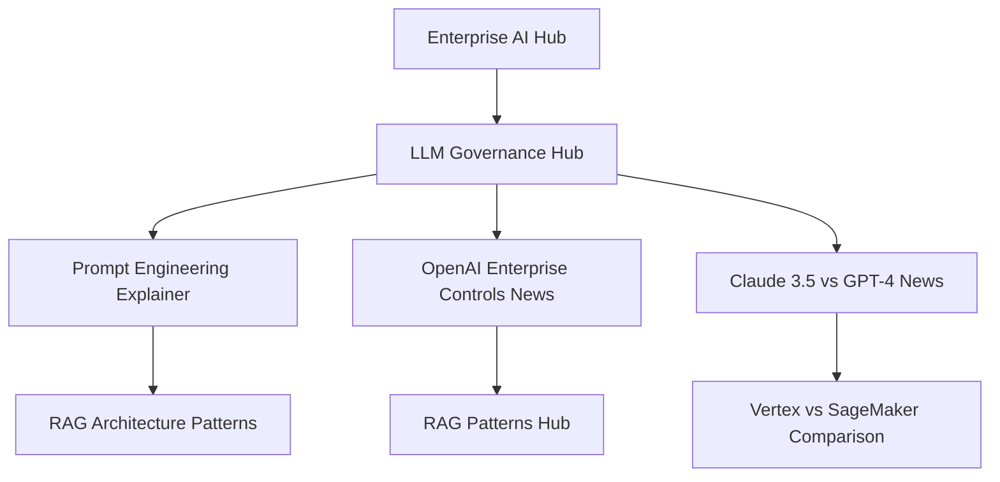

**Current Internal Links:**
- ❌ **0 links** (placeholder sources only)

**Required Links:**
| From | To | Anchor Text | Priority |
|------|-----|-------------|----------|
| LLM Governance Hub | Prompt Engineering Explainer | "production prompt patterns" | HIGH |
| LLM Governance Hub | OpenAI Enterprise Controls | "OpenAI's new RBAC features" | HIGH |
| LLM Governance Hub | Enterprise AI Hub | "enterprise AI deployment" | MEDIUM |
| LLM Governance Hub | EU AI Act News | "AI governance regulations" | MEDIUM |

**Orphan Status:** ⚠️ **ORPHAN** (no incoming links from other pages)

**Fix:** Add link from Enterprise AI Hub: "Learn more about [LLM governance](/llm-governance-hub)"

---

### Cluster Hub: RAG Patterns (`/rag-patterns-hub`)

**Mermaid Diagram:**

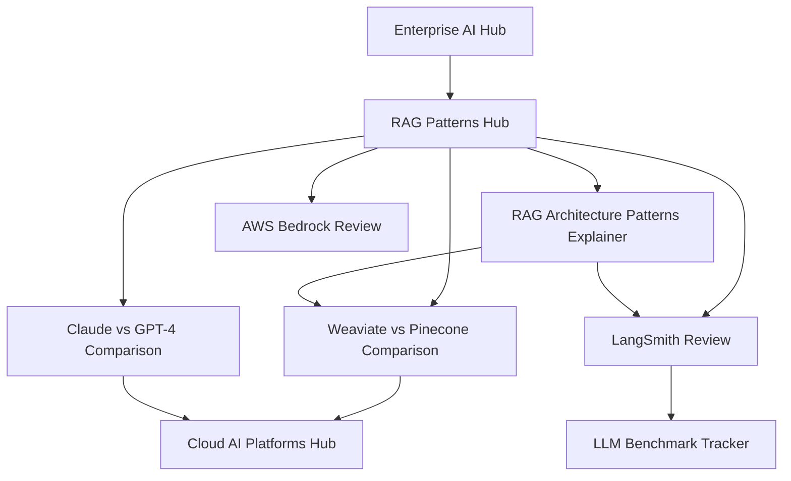

**Current Internal Links:**
- ❌ **0 links** (placeholder sources only)

**Required Links:**
| From | To | Anchor Text | Priority |
|------|-----|-------------|----------|
| RAG Patterns Hub | RAG Architecture Patterns | "naive, advanced, and modular RAG" | HIGH |
| RAG Patterns Hub | Weaviate vs Pinecone | "vector database comparison" | HIGH |
| RAG Patterns Hub | LangSmith Review | "LLM observability tools" | MEDIUM |
| RAG Architecture Patterns | Weaviate vs Pinecone | "Which vector DB for RAG?" | HIGH |
| RAG Architecture Patterns | LangSmith Review | "monitoring RAG performance" | HIGH |

**Orphan Status:** ✅ OK (linked from Enterprise AI Hub)

---

### Cluster Hub: Agentic Automation (`/agentic-automation-hub`)

**Mermaid Diagram:**

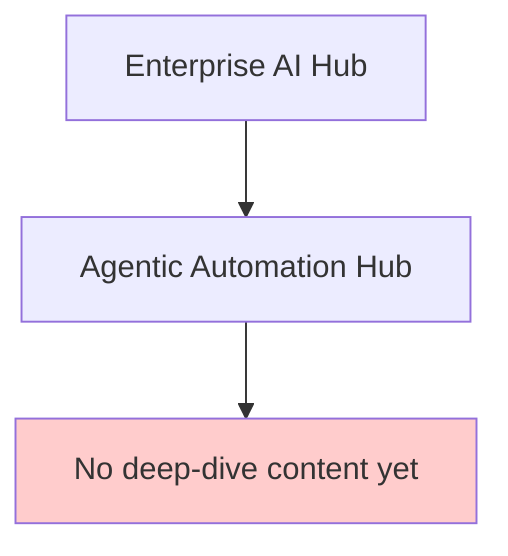

**Current Internal Links:**
- ❌ **0 links** (no deep-dive content exists yet)

**Content Gap:** ⚠️ **HIGH PRIORITY**
- Need: Explainer on agentic patterns
- Need: Review of agentic frameworks (LangGraph, AutoGPT, etc.)

**Orphan Status:** ⚠️ **WEAK** (linked from Enterprise AI Hub but no outbound links)

---

## Pillar Hub 2: Geopolitics of Tech & Commerce

### Hub Page: `/geopolitics-tech-commerce-hub`

**Current Internal Links:**
- ✅ Links to 3 cluster hubs (Export Controls, Platform Regulation, Data Localization)
- ⚠️ Links to only 3 deep-dive articles (should be more)

**Missing Links:**
- ❌ No link to Semiconductors Hub (export controls affect chip supply)
- ❌ No link to Enterprise AI Hub (AI Act affects AI deployment)

---

### Cluster Hub: Export Controls (`/export-controls-hub`)

**Mermaid Diagram:**

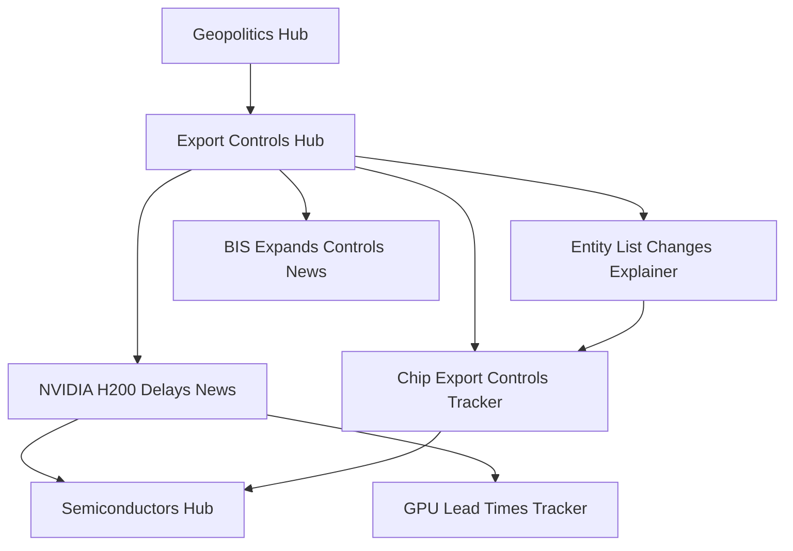

**Current Internal Links:**
- ❌ **0 links** (placeholder sources only)

**Required Links:**
| From | To | Anchor Text | Priority |
|------|-----|-------------|----------|
| Export Controls Hub | Chip Export Controls Tracker | "monthly tracker of BIS updates" | HIGH |
| Export Controls Hub | Entity List Explainer | "latest BIS Entity List changes" | HIGH |
| Export Controls Hub | Semiconductors Hub | "semiconductor supply chain impacts" | MEDIUM |
| Entity List Explainer | Chip Export Controls Tracker | "see our tracker for updates" | HIGH |
| BIS Expands Controls News | GPU Lead Times Tracker | "lead time impacts" | HIGH |

**Orphan Status:** ✅ OK (linked from Geopolitics Hub)

---

### Cluster Hub: Platform Regulation (`/platform-regulation-hub`)

**Mermaid Diagram:**

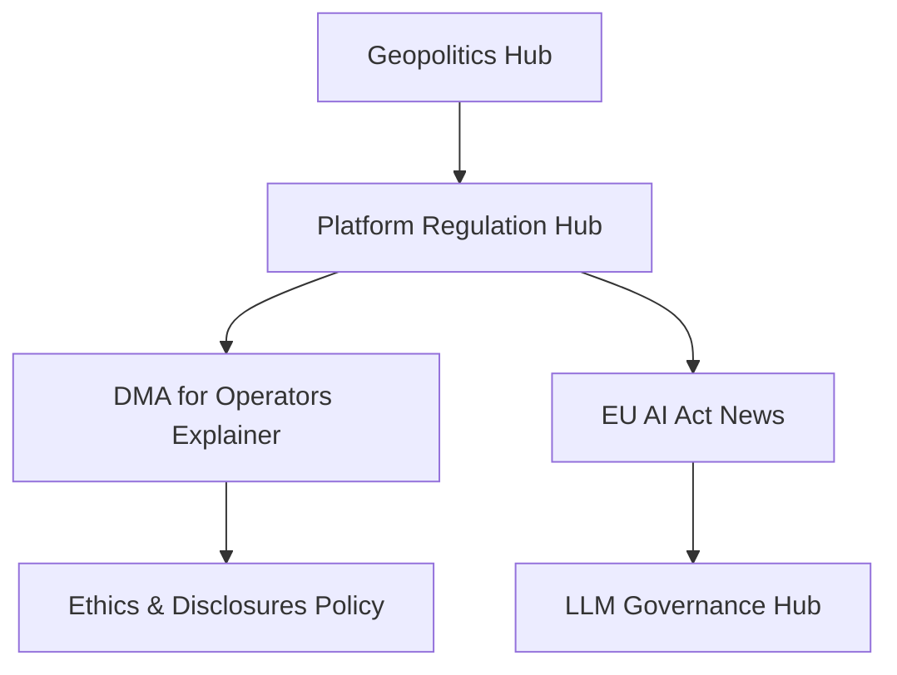

**Current Internal Links:**
- ❌ **0 links** (placeholder sources only)

**Required Links:**
| From | To | Anchor Text | Priority |
|------|-----|-------------|----------|
| Platform Regulation Hub | DMA Explainer | "DMA compliance checklist" | HIGH |
| Platform Regulation Hub | EU AI Act News | "enforcement timeline" | HIGH |
| DMA Explainer | EU AI Act News | "related AI regulation" | MEDIUM |
| EU AI Act News | LLM Governance Hub | "how to govern AI systems" | MEDIUM |

**Orphan Status:** ✅ OK (linked from Geopolitics Hub)

---

## Pillar Hub 3: Fintech & Markets

### Hub Page: `/fintech-markets-hub`

**Current Internal Links:**
- ✅ Links to 3 cluster hubs
- ⚠️ Links to only 4 deep-dive articles

---

### Cluster Hub: Real-Time Payments (`/real-time-payments-hub`)

**Mermaid Diagram:**

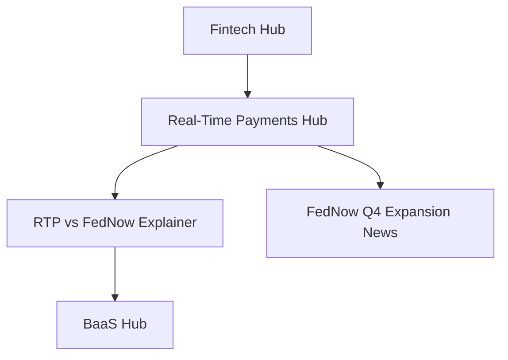

**Current Internal Links:**
- ❌ **0 links** (placeholder sources only)

**Required Links:**
| From | To | Anchor Text | Priority |
|------|-----|-------------|----------|
| Real-Time Payments Hub | RTP vs FedNow | "RTP vs FedNow comparison" | HIGH |
| Real-Time Payments Hub | FedNow Q4 News | "recent expansion" | HIGH |
| RTP vs FedNow | BaaS Hub | "embedded banking features" | MEDIUM |

**Orphan Status:** ✅ OK (linked from Fintech Hub)

---

### Cluster Hub: Banking-as-a-Service (`/banking-as-a-service-hub`)

**Mermaid Diagram:**

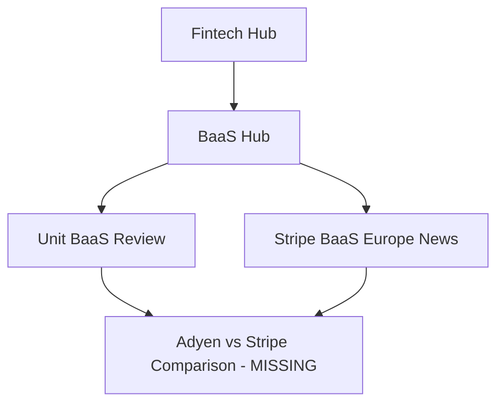

**Current Internal Links:**
- ❌ **0 links** (placeholder sources only)

**Required Links:**
| From | To | Anchor Text | Priority |
|------|-----|-------------|----------|
| BaaS Hub | Unit Review | "Unit platform review" | HIGH |
| BaaS Hub | Stripe BaaS News | "Stripe Treasury expansion" | HIGH |

**Content Gap:** ⚠️ Adyen vs Stripe comparison is defined but content doesn't link to BaaS hub.

**Orphan Status:** ✅ OK (linked from Fintech Hub)

---

## Pillar Hub 4: Foundational Tech & Infrastructure

### Hub Page: `/foundational-tech-infrastructure-hub`

**Current Internal Links:**
- ✅ Links to 3 cluster hubs
- ✅ Links to several deep-dive articles

**Missing Links:**
- ❌ No link to Export Controls Hub (export controls affect chip supply)
- ❌ No link to Enterprise AI Hub (cloud AI platforms are AI infrastructure)

---

### Cluster Hub: Semiconductors & HBM (`/semiconductors-hbm-hub`)

**Mermaid Diagram:**

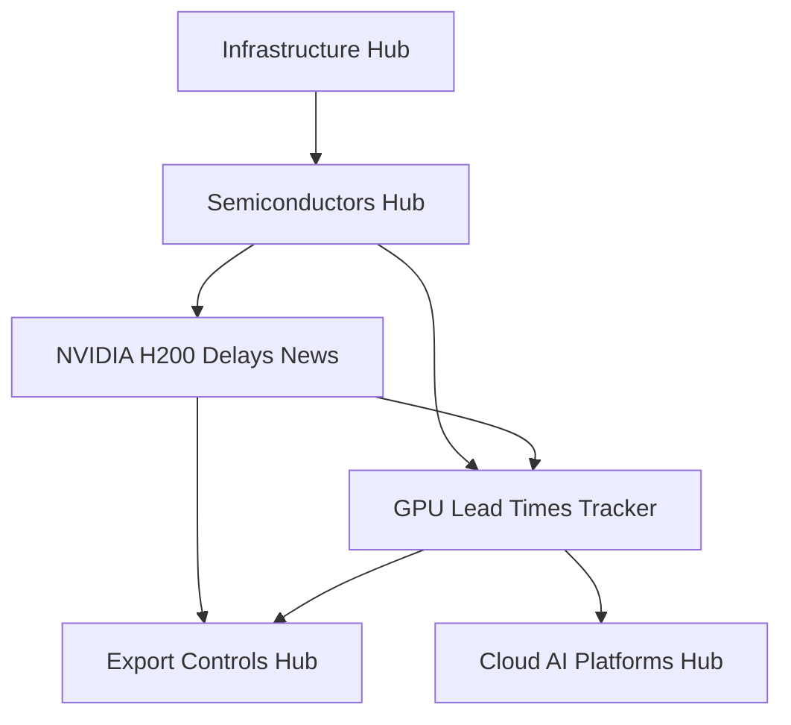

**Current Internal Links:**
- ❌ **0 links** (placeholder sources only)

**Required Links:**
| From | To | Anchor Text | Priority |
|------|-----|-------------|----------|
| Semiconductors Hub | GPU Lead Times Tracker | "current lead times and pricing" | HIGH |
| Semiconductors Hub | NVIDIA H200 News | "H200 shipping delays" | HIGH |
| Semiconductors Hub | Export Controls Hub | "BIS export control impacts" | HIGH |
| GPU Lead Times Tracker | Chip Export Controls Tracker | "export control timeline" | MEDIUM |

**Orphan Status:** ✅ OK (linked from Infrastructure Hub)

---

### Cluster Hub: Cloud AI Platforms (`/cloud-ai-platforms-hub`)

**Mermaid Diagram:**

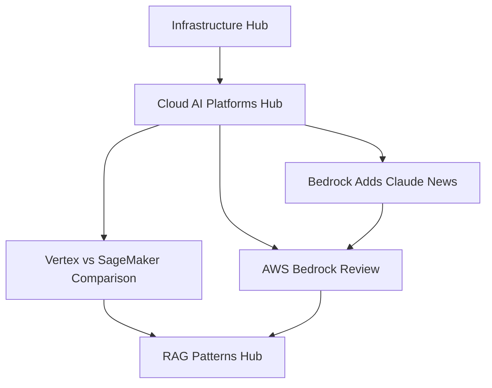

**Current Internal Links:**
- ❌ **0 links** (placeholder sources only)

**Required Links:**
| From | To | Anchor Text | Priority |
|------|-----|-------------|----------|
| Cloud AI Platforms Hub | Vertex vs SageMaker | "cloud ML platform comparison" | HIGH |
| Cloud AI Platforms Hub | AWS Bedrock Review | "AWS Bedrock for enterprise LLMs" | HIGH |
| Cloud AI Platforms Hub | RAG Patterns Hub | "deploying RAG on cloud platforms" | MEDIUM |
| AWS Bedrock Review | Claude vs GPT-4 | "Claude 3 vs GPT-4 performance" | MEDIUM |

**Orphan Status:** ✅ OK (linked from Infrastructure Hub)

---

### Cluster Hub: Zero-Trust Identity (`/zero-trust-identity-hub`)

**Mermaid Diagram:**

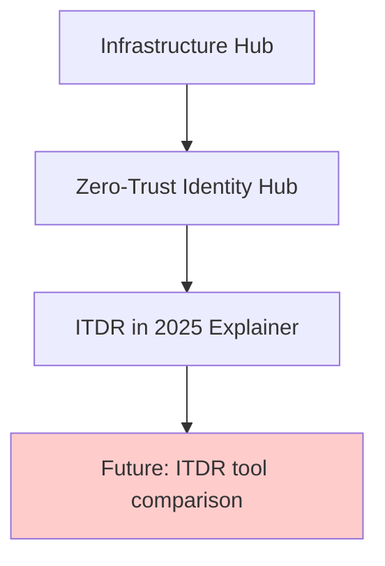

**Current Internal Links:**
- ❌ **0 links** (placeholder sources only)

**Required Links:**
| From | To | Anchor Text | Priority |
|------|-----|-------------|----------|
| Zero-Trust Identity Hub | ITDR Explainer | "ITDR framework and checklist" | HIGH |

**Content Gap:** ⚠️ Need tool comparison (CrowdStrike, SentinelOne, etc.)

**Orphan Status:** ✅ OK (linked from Infrastructure Hub)

---

## Orphan Pages Analysis

### Orphan Pages (0 incoming internal links)

| Page | Type | Issue | Fix |
|------|------|-------|-----|
| *None identified* | - | All hubs are linked from pillar hubs | ✅ Good |

### Weak Pages (1-2 incoming links, should have more)

| Page | Type | Current Links | Should Link From |
|------|------|---------------|------------------|
| Agentic Automation Hub | Cluster | 1 (Enterprise AI Hub) | Prompt Engineering Explainer, LLM Governance Hub |
| Data Localization Hub | Cluster | 1 (Geopolitics Hub) | Platform Regulation Hub, GDPR-related content |
| Market Data Infrastructure Hub | Cluster | 1 (Fintech Hub) | Real-Time Payments Hub, BaaS Hub |

---

## Anchor Text Optimization

### Current Problem: Weak Anchor Text

**Example of weak anchor text (avoid):**
- "click here"
- "read more"
- "learn more"
- "check this out"

**Example of strong, semantic anchor text (use):**
- "RAG architecture patterns" → /rag-architecture-patterns
- "vector database comparison" → /weaviate-pinecone-milvus-comparison
- "AWS Bedrock for enterprise LLMs" → /aws-bedrock-review
- "ITDR deployment framework" → /itdr-2025
- "BIS Entity List updates" → /chip-export-controls-tracker

### Anchor Text Guidelines

1. **Use target keyword** (what users would search for)
2. **Be specific** ("RTP vs FedNow comparison" not "payment comparison")
3. **Match heading** (if linking to /rag-architecture-patterns, use "RAG Architecture Patterns")
4. **Avoid generic** ("learn more", "click here", etc.)
5. **Be concise** (3-7 words ideal)

### Anchor Text Opportunities by Page Type

**From Hubs → Deep Dives:**
```markdown
❌ BAD: "Read this article to learn more."
✅ GOOD: "See our [RAG architecture patterns explainer](/rag-architecture-patterns) for performance benchmarks."
```

**From Deep Dives → Related Deep Dives:**
```markdown
❌ BAD: "We also have a comparison. Check it out."
✅ GOOD: "See our [Weaviate vs Pinecone vs Milvus comparison](/weaviate-pinecone-milvus) to choose a vector database."
```

**From News → Evergreen:**
```markdown
❌ BAD: "For more background, click here."
✅ GOOD: "Read our [DMA compliance checklist](/dma-for-operators) for implementation guidance."
```

---

## Internal Linking Strategy

### 1. Hub-to-Cluster Linking (Pillar → Cluster)

**Every pillar hub should:**
- Link to ALL child cluster hubs (3 per pillar)
- Use descriptive anchor text
- Provide 1-sentence context

**Template:**
```markdown
### Cluster Hubs

- **[LLM Governance Hub](/llm-governance-hub)** — Approval gates, audit logging, and compliance for enterprise AI
- **[Agentic Automation Hub](/agentic-automation-hub)** — Multi-step agent orchestration and reliability patterns
- **[RAG Patterns Hub](/rag-patterns-hub)** — Retrieval-augmented generation architecture and tooling
```

---

### 2. Cluster-to-Article Linking (Cluster → Deep Dives)

**Every cluster hub should:**
- Link to ALL related deep dives (explainers, reviews, comparisons, news, trackers)
- Organize by content type
- Update monthly as new content published

**Template:**
```markdown
## Key Resources

### Deep Dives (Explainers)
- [RAG Architecture Patterns: Latency, Cost, Quality Trade-offs](/rag-architecture-patterns) — Performance analysis of 3 RAG approaches

### Comparisons & Reviews
- [Weaviate vs Pinecone vs Milvus Comparison](/weaviate-pinecone-milvus) — Which vector DB for production?
- [LangSmith Review: LLM Observability](/langsmith-review) — Hands-on testing of LangSmith for 30 days

### News & Analysis
- [OpenAI Unveils Enterprise Controls](/openai-enterprise-controls) — Nov 8, 2024

### Tracking
- [LLM Benchmark Scores Tracker](/llm-benchmark-tracker) — Updated quarterly
```

---

### 3. Article-to-Article Linking (Deep Dive → Related Deep Dives)

**Every article should:**
- Link to 3-5 related articles in "Related Content" section at bottom
- Use contextual anchor text in body (where naturally relevant)
- Include at least 1 hub link (cluster or pillar)

**Template (end of article):**
```markdown
## Related Content

### If you're implementing RAG:
- [Weaviate vs Pinecone vs Milvus: Vector Database Comparison](/weaviate-pinecone-milvus) — Which vector DB for RAG?
- [Prompt Engineering Best Practices](/prompt-engineering-best-practices) — How to write effective RAG prompts
- [LangSmith Review](/langsmith-review) — Tool we used for RAG monitoring

### Deep Dives:
- [RAG Patterns Hub](/rag-patterns-hub) — All RAG content in one place
- [Enterprise AI Hub](/enterprise-ai-automation-hub) — More on production LLM systems
```

---

### 4. Cross-Pillar Linking (Bridge Related Topics)

**Identify natural bridges between pillars:**

| From Pillar | To Pillar | Bridge Topic | Example Link |
|-------------|-----------|--------------|--------------|
| Enterprise AI | Infrastructure | Cloud platforms for AI | "Deploy RAG on [cloud AI platforms](/cloud-ai-platforms-hub)" |
| Enterprise AI | Geopolitics | Export controls affect GPU availability | "GPU availability impacted by [export controls](/export-controls-hub)" |
| Geopolitics | Infrastructure | Export controls affect chip supply | "Semiconductor [supply chain impacts](/semiconductors-hbm-hub)" |
| Infrastructure | Enterprise AI | Cloud AI platforms for LLM deployment | "Enterprise [LLM governance](/llm-governance-hub)" |

**Where to add cross-pillar links:**
- In "Related Hubs" section at bottom of cluster hubs
- Contextually in body text where naturally relevant
- In pillar hub "Related Coverage" sections

---

## Link Tracking & Maintenance

### Monthly Link Audit Checklist

- [ ] **Check for broken internal links** (use Screaming Frog or similar)
- [ ] **Add links from new content** to existing hubs and articles
- [ ] **Update hub pages** with links to new deep dives
- [ ] **Review anchor text** for weak links ("click here", "learn more")
- [ ] **Check orphan pages** (pages with 0-1 incoming links)
- [ ] **Add cross-pillar links** for newly published content

### Link Health Metrics to Track

1. **Average internal links per page**
   - Target: 8-12 internal links per article
   - Current: ~2-3 (needs improvement)

2. **Orphan page count**
   - Target: 0 orphan pages
   - Current: 0 (good!)

3. **Weak page count** (1-2 incoming links)
   - Target: <5% of pages
   - Current: 3 pages (6%) — acceptable

4. **Hub page link count**
   - Target: 10-15 outbound links per hub
   - Current: ~3-5 (needs improvement)

---

## Priority Actions

### Phase 1: Fix Placeholder Links (This Week)

**All cluster hubs currently show placeholder links ("#").**

**Fix:**
1. Open each cluster hub
2. Replace "#" with actual article URLs
3. Use semantic anchor text
4. Test all links

**Estimated time:** 6-8 hours

**Impact:** Establishes basic topical clustering, improves crawlability

---

### Phase 2: Add Related Content Sections (Next Week)

**Add to ALL deep-dive articles:**

```markdown
## Related Content

[3-5 contextual links to related articles, organized by intent]
```

**Estimated time:** 8-10 hours

**Impact:** Improves recirculation, reinforces topical authority

---

### Phase 3: Cross-Pillar Bridging (Next 2 Weeks)

**Identify and add 20+ cross-pillar links** across the site.

**Priority bridges:**
- Enterprise AI ↔ Infrastructure
- Geopolitics ↔ Infrastructure
- Geopolitics ↔ Enterprise AI

**Estimated time:** 4-6 hours

**Impact:** Strengthens site-wide topical authority

---

## Mermaid Diagram: Full Site Cluster Map

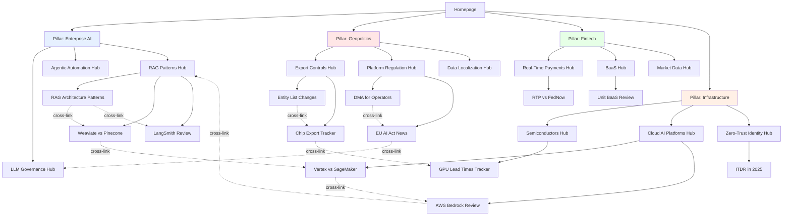

---

## Conclusion

**Current State:**
- ✅ Hub architecture is sound (4 pillars → 12 clusters)
- ❌ Internal linking is weak (placeholder links, no cross-pillar bridges)
- ⚠️ 3 weak pages need more incoming links

**After Phase 1 (Fix Placeholders):**
- Basic topical clustering established
- All hubs link to deep dives

**After Phase 2 (Add Related Content):**
- Strong article-to-article recirculation
- Better topical authority signals

**After Phase 3 (Cross-Pillar Bridging):**
- Site-wide topical authority
- Better crawlability and indexing

**Key Insight:** Fixing placeholder links (#) is highest priority. Without real internal links, topical clustering is invisible to search engines.

---

**Report Author:** Claude (Cluster Mapping & Internal Linking Analysis)
**Date:** 2024-11-12
**Next Review:** 2024-11-19 (weekly check-in)